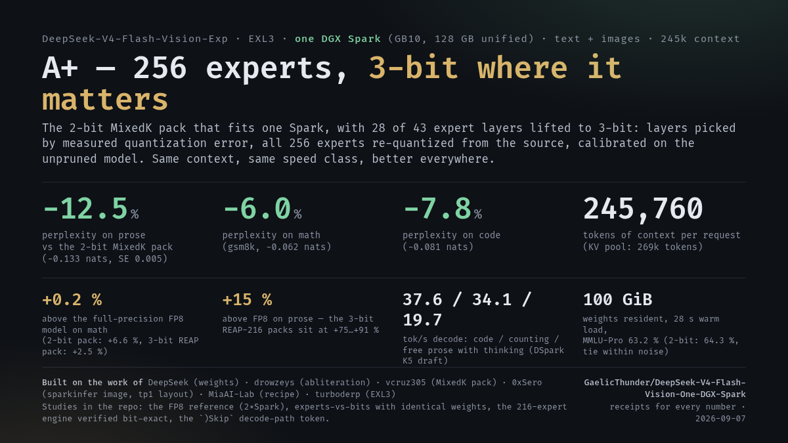
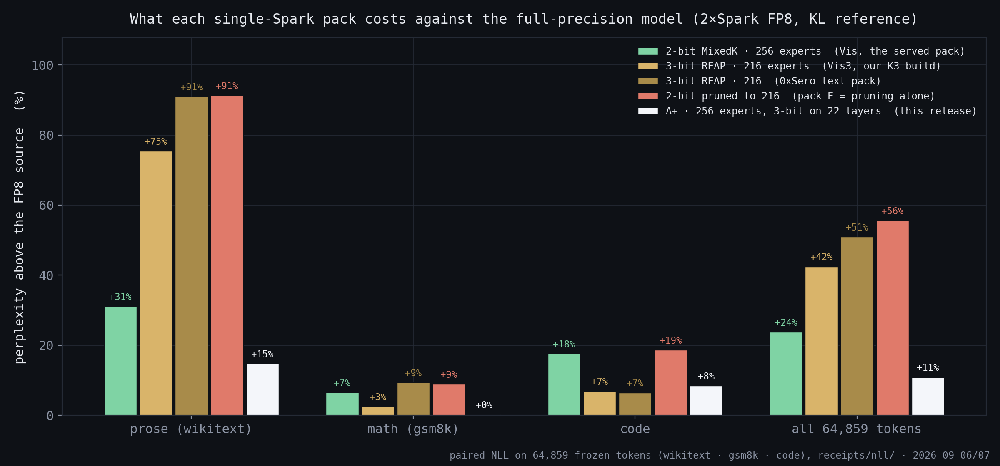

# DeepSeek-V4-Flash-Vision on one DGX Spark

**Text + images + speculative decoding, 245,760 tokens of context, CUDA graphs on, one GB10.**

This is a serving recipe for [DeepSeek-V4-Flash-Vision-Exp](https://huggingface.co/deepseek-ai/DeepSeek-V4-Flash-Vision-Exp)
(305B MoE, uncensored variant) in EXL3 on a single NVIDIA DGX Spark (GB10, 128 GB unified memory). It takes
the [MixedK pack](https://huggingface.co/vcruz305/DSV4-Flash-Vision-ablit-EXL3-MixedK) published by
vcruz305 — all 256 routed experts, 2-bit trellis with six layers at 3-bit, ~95 GB — and runs it on the
NVIDIA sparkinfer image that the [MiaAI-Lab recipe](https://github.com/MiaAI-Lab/DeepSeek-v4-Flash-One-DGX-Spark)
uses for the text model, with the vision model support of vLLM
[PR #54566](https://github.com/vllm-project/vllm/pull/54566) ported onto that image as a read-only overlay.
No image rebuild, no CUDA compile: every kernel involved is Triton.

Everything below was measured on 2026-09-03 on one machine. The raw outputs are in [`receipts/`](receipts/).

| | measured |
|---|---|
| context | **245,760** tokens per request |
| KV pool | **986,275** tokens at `gpu_memory_utilization 0.88` (4.01 requests of full length) |
| weights resident | 83.58 GiB (`Model loading took`) |
| decode, DSpark K5 draft | **35.3 tok/s** code · 36.0 counting · **23.3 tok/s** free prose with thinking (medians of 3) |
| prefill | 1,239 / 1,198 / 1,130 tok/s at 16k / 64k / 128k prompt (salted, no prefix-cache hits) |
| images | yes — same process, same endpoint (`/v1/chat/completions` with `image_url`) |
| CUDA graphs | captured (PIECEWISE + FULL), not `enforce-eager` |
| load | ~2 min cold from NVMe, 25 s with a warm page cache; the first boot compiles ~10 min of kernels into `cache/` |
| MMLU-Pro (251 items, 10-way, letter logprob) | **64.3 %** — vs 60.8 % for the 3-bit REAP-pruned text recipe on the same items |

## A+ — 256 experts, 3-bit where it matters (2026-09-07)



The question this repository kept asking was *experts or bits*: the single-Spark packs published so far either keep
all 256 experts at 2-bit (this recipe, MixedK) or drop 40 experts to afford 3-bit (the REAP-K216 packs). **A+** stops
choosing: it keeps every expert and lifts **28 of the 43 expert layers to 3-bit** — the 6 the MixedK pack already had
plus 22 picked by their measured quantization error, all 256 experts of each re-quantized from the source
(abliterated) weights with the unpruned model as calibration. It is the first single-Spark pack that beats the 2-bit
one on prose, math and code at the same time, at the same 245,760-token context.

| paired on 64,859 frozen tokens | prose (wikitext) | math (gsm8k) | code | everything |
|---|---|---|---|---|
| **A+ − 2-bit MixedK** (nats, negative = better) | **−0.133** ± 0.005 | **−0.062** ± 0.008 | **−0.081** ± 0.005 | −0.109 |
| as perplexity | −12.5 % | −6.0 % | −7.8 % | −10.3 % |
| A+ above the FP8 source (2×Spark, full precision) | +14.7 % | **+0.2 %** | +8.5 % | +10.9 % |
| 2-bit MixedK above the source | +31 % | +6.6 % | +18 % | +24 % |
| 3-bit REAP-216 (this build) above the source | +75 % | +2.5 % | +7.0 % | +42 % |

| A+ on one GB10 | measured |
|---|---|
| weights resident | **100.08 GiB** (`Model loading took`), 28 s warm load |
| context | 245,760 per request, KV pool 269,471 tokens at `UTIL=0.925` (26 promoted layers do not fit: 0.63 GiB of KV left) |
| decode, DSpark K5 draft | 37.6 tok/s code · 34.1 counting · 19.7 free prose with thinking (2-bit: 37.5 · 37.3 · 21.8) |
| verify steps | 10.4–10.5 /s (2-bit: 11.4) — the extra 3-bit bytes cost ~8 % per step |
| MMLU-Pro, 251 items, two option orders | 63.2 % (2-bit: 64.3 %; run-to-run noise ±1 item, the difference is inside it) |
| perplexity, 8 fixed passages | 4.487 (2-bit 4.545, 3-bit REAP 5.373) |

How it was built, why these layers, and the four studies behind it (the FP8 reference, *experts versus bits* separated
with byte-identical weights, the 216-expert engine path verified bit-exact against a float reference, and the retraction
of an earlier "pruning is free" result) are in [`docs/APLUS.md`](docs/APLUS.md). Figures: [`assets/aplus/`](assets/aplus/).
Build scripts (pod conversion, splice, pack assembly, boot ladder): [`scripts/aplus/`](scripts/aplus/). Receipts:
[`receipts/nll/`](receipts/nll/) and [`receipts/aplus/`](receipts/aplus/).



## Why this recipe exists

Two recipes for DeepSeek-V4-Flash already run on one Spark. MiaAI-Lab serves the **text** model from
0xSero's REAP-pruned pack (216 of 256 experts, uniform 3-bit) at ~46 tok/s and 245k context. vcruz305 serves
the **vision** model from the MixedK pack on PyPI vLLM nightly + a plugin, verified at 65,536 context,
`enforce-eager`, 19.7 tok/s.

This one takes the vision pack and puts it on the MiaAI-Lab/0xSero runtime, which is the faster and
more memory-efficient of the two (CUDA graphs, fp8 KV records, the SM120 MLA kernels). To do that it has to

1. **convert the pack** into the "rank-sliced tp1" checkpoint layout the image loads (expert payloads copied
   byte for byte, BF16 projections requantized to the FP8 block format the image expects);
2. **let the trellis kernels accept 2-bit** — the image guards `K ∈ {3,4,5,6}` in six places, one of them hidden
   in a dataclass `__post_init__`;
3. **give each layer its own MoE scratch plan** — mixed 2/3-bit layers collided in one shared arena;
4. **port the vision model** (vLLM PR #54566, merged 2026-09-02) onto the month-older vLLM fork inside the image —
   nine incompatibilities, listed in [`docs/PORT_NOTES.md`](docs/PORT_NOTES.md), including the one that
   matters on unified memory: upstream's `load_weights` sorts the whole checkpoint iterator, which materializes
   all 138,681 tensors at once and kills a 128 GB box. Here the language model streams and only the 0.9 GB of
   vision tensors are deferred;
5. **keep image-token expert routing CUDA-graph safe** — the upstream re-route uses `.any()` / `.nonzero()`,
   which abort graph capture; the overlay version is branchless.

## Results

### Quality: 2-bit with 256 experts vs 3-bit with 216

The obvious question is what 2-bit costs. The honest answer is that it can't be isolated on this hardware:
a 256-expert 3-bit pack is ~130 GB and does not fit, which is why the published pack is MixedK. What can be
measured is the choice a Spark owner actually has — this recipe against the MiaAI-Lab/0xSero one — on identical,
frozen items with identical grading. The third column is the same 3-bit engine with its runtime refusal-ablation
hook switched off, to check that the hook is not what separates the two.

| | **this recipe** — 2-bit MixedK, 256 experts, vision | MiaAI-Lab/0xSero — 3-bit REAP, 216 experts | same, runtime ablation off |
|---|---|---|---|
| MMLU-Pro, original option order | 161/251 = 64.1 % | 156/251 = 62.2 % | 154/251 = 61.4 % |
| MMLU-Pro, options rotated by 3 | 162/251 = 64.5 % | 149/251 = 59.4 % | 148/251 = 59.0 % |
| **MMLU-Pro mean** | **64.3 %** | **60.8 %** | **60.2 %** |
| correct under both orders | 134/251 | 123/251 | 119/251 |
| self-agreement across orders | 78.1 % | 76.5 % | 74.5 % |
| MATH-500 level 5 (60, `\boxed{}` exact) | 50/60 · 49/60 (two boots) | 50/60 | 48/60 |
| needle retrieval, 3 depths × 4k/32k/131k | 9/9 · 9/9 | 9/9 | — |
| perplexity, 8 fixed passages | 4.545 · 4.543 | 5.373 | 5.434 |

Paired on the 502 MMLU-Pro decisions: 323 correct vs 305, 94 discordant (56 only this recipe, 38 only the
3-bit), exact McNemar **p = 0.079**. So: not worse is solid; the 3.6-point lead is at the edge of noise.
On MATH the two engines solve 49 of the same problems and one different geometry item each. Run-to-run noise
of the harness itself, measured by repeating this recipe on a second boot: ±1 item.

Keeping all 256 experts costs less than dropping 40 of them and keeping a bit — and, since 2026-09-07, keeping all 256
*and* lifting the sensitive layers to 3-bit costs less still: see [A+](#a--256-experts-3-bit-where-it-matters-2026-09-07)
and the corrected experts-versus-bits accounting in [`docs/APLUS.md`](docs/APLUS.md#3-experts-versus-bits-with-the-same-weights). Method and per-category
numbers: [`docs/BENCHMARK.md`](docs/BENCHMARK.md).

### Speed, and where the 3-bit recipe is faster

Measured with `scripts/dsbench.py`, which reads vLLM's `spec_decode_*` counters so acceptance and raw step
rate are separated instead of folded into tok/s. Medians of 3, single stream.

| task | this recipe | τ (accepted/step) | verify steps/s | 3-bit REAP recipe | τ | steps/s |
|---|---|---|---|---|---|---|
| count to 220, T=0 | 36.0 tok/s | 3.26 | 11.07 | 46.1 tok/s | 4.44 | 10.36 |
| code, T=0 | 35.3 tok/s | 3.23 | 10.94 | 41.8 tok/s | 4.10 | 10.19 |
| prose, T=1, thinking | **23.3 tok/s** | 2.11 | 11.02 | 21.1 tok/s | 2.05 | 10.32 |

The engine here does **more verify steps per second** (11.0 vs 10.3): 2-bit experts are cheaper to read.
It loses on structured output because the draft agrees less with a 256-expert 2-bit target (τ 3.2 vs 4.1) —
the K64 draft is built the same way in both recipes, from the target's own MTP layers. Where the draft is
weak for everyone (free prose), this recipe is the faster one. Retraining the draft against this target is the
obvious next step ([TODO.md](TODO.md)).

Prefill and decode after a long prompt (`scripts/bench-ctx.py`, real tokenizer, salted prompts):

| prompt tokens | prefill | decode after it | 3-bit recipe prefill | decode |
|---|---|---|---|---|
| 16,375 | 1,239 tok/s | 10.7 tok/s | 1,179 tok/s | 10.2 tok/s |
| 65,515 | 1,198 tok/s | 11.0 tok/s | 1,202 tok/s | 10.7 tok/s |
| 130,983 | 1,130 tok/s | 11.4 tok/s | 1,132 tok/s | 11.3 tok/s |

### Vision

`scripts/vision_probe.py` sends three images through `/v1/chat/completions`: a synthetic card (red square,
blue circle, green triangle, two lines of text), a photograph of a Pallas's cat in snow, and a COCO frame with two
cats and two remote controls. The model names the shapes and colours, reads both text lines, identifies the
species, and counts 0 people / 2 animals / 2 objects. 227–392 prompt tokens per image, 3–4 s per answer,
re-verified after every reboot in the benchmark chain. Multi-image prompts and tool calls with images have not
been exercised yet.

### A token the decode path invents: `)Skip`

Roughly once every few thousand tokens this stack glues the token `)Skip` (id 83480) onto the end of a
clause — *"All 153 tests pass)Skip."* It is not a sampling artifact. Scored through the **prefill** path
the model gives that token p 0.007 at rank 7; the **decode** path, on the identical prefix, puts it first
at p 0.65, deterministically, even at temperature 0. Its `head.weight` row is a 2.25× outlier (rank 28 of
129,280) in this pack *and* in the 3-bit text pack, so it is a property of the released DeepSeek head, and
a small decode-only perturbation of the hidden state is enough to make it the argmax where the true
distribution is flat. It also lands inside tool-call arguments and hidden reasoning, so it corrupts files,
not just prose.

The mitigation costs nothing and needs no restart — add `"bad_words": [")Skip", ",Skip", ".Skip"]` to your
requests, or put [`scripts/badwords_proxy.py`](scripts/badwords_proxy.py) in front of the engine if your
client cannot. `top_p`/`top_k` do not help (the token is already rank 1 in the bad row) and `min_p` /
`logit_bias` are rejected outright under speculative decoding.

Status 2026-09-05: it reproduces with speculation off (`MODE=mtp0`, p 0.27 at the seeded slot), so the verify block
and the sampler are out; switching the sparse indexer to `native` or the MoE activations to 16-bit leaves the
seeded-slot probability bit-identical (0.6473), so the fault sits in the part of the decode path those knobs do not
touch. A free 400-token run is a lottery (it reports "clean" whenever it never wanders into the trap); the seeded slot
(`tools/decode_vs_prefill.py`, `tools/token_leak_probe.py --verify-fix`) is the test. The mitigation above is
unchanged and is what the reference deployment runs at its gateway.

Full evidence, the exonerated suspects, the remaining kernel A/B and the detector
([`tools/token_leak_probe.py`](tools/token_leak_probe.py), which finds this class of fault on any model
without knowing the token id) are in [`docs/DECODE_PATH_TOKEN_LEAK.md`](docs/DECODE_PATH_TOKEN_LEAK.md).

## Requirements

- One NVIDIA DGX Spark (GB10 / SM121, 128 GB unified memory). Tested on the ASUS Ascent GX10 build.
- Docker with the NVIDIA container runtime; the image pulls ~20 GB.
- Disk: ~95 GB for the pack, ~92 GB for the converted checkpoint + draft. The pack can be deleted after
  `verify_tp1.py` passes. NVMe for the converted checkpoint (load speed is disk speed).
- Host Python 3 with `torch` and `safetensors` for the conversion (CPU only), `datasets` if you want to rerun
  the benchmark, `huggingface_hub` + `hf_xet` for the download.
- Accept the pack's gated terms on Hugging Face. The model has had its refusals removed; it is published for
  red-teaming, security research and evaluation, and you are responsible for your deployment.

## Quick start

```bash
git clone https://github.com/GaelicThunder/DeepSeek-V4-Flash-Vision-One-DGX-Spark
cd DeepSeek-V4-Flash-Vision-One-DGX-Spark

hf auth login                       # once; the pack is gated
scripts/download.sh                 # ~95 GB -> ~/models/dsv4-vision-ablit-exl3-mixedk
scripts/convert.sh                  # -> ~/models/deepseek-v4-flash-vision-spark/{tp1,dspark-draft-k64}, ~30 min
scripts/serve.sh                    # docker run; follow with: docker logs -f dsvision-spark

curl -s localhost:30021/v1/models   # ready when this answers (first boot: ~12 min of kernel compilation)
scripts/vision_probe.py http://127.0.0.1:30021 deepseek-v4-flash-vision-exp
```

Chat, with an image:

```bash
curl -s localhost:30021/v1/chat/completions -H 'Content-Type: application/json' -d '{
  "model": "deepseek-v4-flash-vision-exp",
  "messages": [{"role": "user", "content": [
    {"type": "text", "text": "What is in this picture?"},
    {"type": "image_url", "image_url": {"url": "data:image/png;base64,'"$(base64 -w0 scripts/testimg/shapes.png)"'"}}
  ]}],
  "max_tokens": 300, "chat_template_kwargs": {"thinking": false}}'
```

`scripts/stop.sh` removes the container. `DRY_RUN=1 scripts/serve.sh` prints the full `docker run`.

## How it is put together

```
ghcr.io/0xsero/deepseek-v4-flash-0731-spark-sparkinfer   NVIDIA 26.02 vLLM fork + sparkinfer kernels (pinned digest)
  └─ third_party/MiaAI-Lab-…/image-patch/                 MiaAI-Lab's 256k entrypoint, launcher, DSpark draft class,
                                                          SM120 MLA prefill, tiny-decode kernel (MIT, verbatim)
       └─ overlay/dsvision/                               this repo: 26 Python files mounted read-only over the image
            sparkinfer/…      5 files   K-guards 3..6 -> 2..6
            vllm/…           21 files   PR #54566 vision port + mixed-K scratch fix + K2 guard in exl3.py
```

`scripts/serve.sh` mounts every `.py` under `overlay/dsvision/` onto the same path inside the container, so a
file's location in the overlay is its location in the image. Nothing is copied into the image and nothing is
compiled; `docker rm` returns the box to stock.

The checkpoint on disk is the 0xSero rank-sliced tp1 layout: `exl3-layer-LLL-tp1-rank0.safetensors` per layer
(routed experts, trellis payloads byte-identical to the pack), `carried-00N.safetensors` (everything else, BF16
projections requantized to FP8 e4m3 + ue8m0 128×128 scales exactly where the reference checkpoint has them),
`carried-vis-00N.safetensors` (vision tower, aligner, image specials, the 46 `gate.bias_vl` routing biases),
`bitrates.json` (per-layer K), and a manifest with sha256 per file. `tools/use_vision.sh {on|off}` flips the
checkpoint between the vision view and a text-only view (same files, different index and config).
Details in [`docs/CONVERSION.md`](docs/CONVERSION.md).

## Knobs

All via environment on `scripts/serve.sh`:

| variable | default | notes |
|---|---|---|
| `CTX` | `245760` | verified ceiling on this pack at util 0.88 with ~9 GB host memory left |
| `UTIL` | `0.88` | 0.86 also verified (KV pool 834,970). Do not go above 0.92 on a Spark: the *driver* starves before the kernel does, and the failure is a hard lock, not an OOM |
| `MODE` | `dspark` | `mtp0` = no speculative decoding (about half the speed, useful for bisecting) |
| `DSPARK_TOKENS` | `5` | draft depth |
| `THINKING` / `EFFORT` | `true` / `max` | chat-template defaults; per request via `chat_template_kwargs` |
| `EXTRA_VLLM_ARGS` | `--long-prefill-token-threshold 4096 --mm-processor-cache-gb 0 --mm-encoder-attn-backend TORCH_SDPA` | both mm flags are required: the 4 GiB processor cache does not fit, and the image has no FlashAttention-2 build (`_vllm_fa2_C` missing) |
| `SERVED_MODEL_NAME` | `deepseek-v4-flash-vision-exp` | |
| `PORT`, `CONTAINER`, `MODELS_DIR` | `30021`, `dsvision-spark`, `~/models/deepseek-v4-flash-vision-spark` | |

With `MODE=dspark` vLLM runs one sequence at a time (`MAX_NUM_SEQS=1`): concurrent requests queue.

## Unified-memory notes (GB10)

- **Page cache counts.** After a download or a previous engine, the file cache of the last model sits in the same
  memory CUDA needs; `MemAvailable` looks fine and the load still dies. `DROP_CACHES=1 scripts/serve.sh`
  drops it (needs sudo). `serve.sh` warns below ~112 GB available.
- **Watch `MemAvailable`, not `nvidia-smi`** (which reads N/A on GB10). The engine needs ~9 GB of host headroom
  at 245k; below ~1 GB the driver fails allocations with `NV_ERR_NO_MEMORY` and the box can hard-lock. A small
  watchdog that kills the container under a floor is worth having; ours lives outside this repo.
- **Loading is where it breaks.** The InstantTensor loader in this image is buffered; anything that materializes the
  weight iterator (a `sorted()`, a `list()`) needs twice the checkpoint. That was the fatal bug in the upstream vision
  loader on this hardware, and vcruz305 hit the same one independently.
- `Running: 1 reqs, Waiting: N` in the log is expected with the draft on.

## Compared with the other single-Spark recipes

| | [MiaAI-Lab](https://github.com/MiaAI-Lab/DeepSeek-v4-Flash-One-DGX-Spark) | [vcruz305](https://github.com/vcruz305/DeepSeek-V4-Flash-Vision-EXL3-MixedK-DGX-Spark-recipe) | this repo |
|---|---|---|---|
| model | V4-Flash 0731, text | V4-Flash-Vision-Exp | V4-Flash-Vision-Exp |
| pack | 0xSero REAP-K216, 3-bit, 95 GB | vcruz305 MixedK, 256 experts, 95 GB | vcruz305 MixedK, converted to tp1 |
| runtime | sparkinfer image | vLLM nightly (PyPI) + `vllm-exl3` plugin | sparkinfer image + overlay |
| context | 245,760 | 65,536 verified | 245,760 |
| KV pool | 255,522 tok (as measured here) | 84,554 @16k · 298–328k @64k | 986,275 @245k |
| CUDA graphs | yes | `enforce-eager` | yes |
| speculative | DSpark K5 | DSpark 3, τ 2.3–3.2 | DSpark K5, τ 3.2 code / 2.1 prose |
| decode | 46 / 42 / 21 tok/s (count / code / prose) | 19.7 tok/s | 36 / 35 / 23 tok/s |
| images | no | yes | yes |
| MMLU-Pro (same 251 items) | 60.8 % | — | 64.3 % |

The vcruz305 recipe carries one fix this one does not need: FlashInfer's sparse-MLA prefill on SM120 expects
128-wide rows and the vision model's bidirectional image spans widen them to 512; he slices and recombines with
log-sum-exp. The encoder here runs on `TORCH_SDPA` and the language side on sparkinfer's own MLA kernels, so the
path is different. Multi-image prompts are the case to watch.

## Repository layout

```
scripts/      download.sh · convert.sh · serve.sh · stop.sh · vision_probe.py · ppl_probe.py · speed_probe.py
              dsbench.py (speed with τ/α) · bench-ctx.py (salted long-context prefill) · bench/ (MMLU-Pro + MATH-500 harness)
              badwords_proxy.py (drop-in `bad_words` injector, stdlib only)
overlay/      the 26 files mounted over the image (this is the port)
tools/        convert_vision_pack.py · add_vision_tensors.py · make_config.py · make_vision_config.py · use_vision.sh
              verify_tp1.py · apply_k2_patch.py (the K-guard edits as a script) · ref_spec.py · make_draft_plan.py
              token_leak_probe.py (prefill-vs-decode logits disagreement detector)
reference/    ref_spec.json (tensor map of the 0xSero tp1 layout, so you don't need that 99 GB checkpoint)
              0xsero-tp1-config.json · draft_plan.json · the produced config-vision.json and bitrates.json · PR #54566 hunks
third_party/  MiaAI-Lab recipe files, verbatim, with license and commit
receipts/     every JSON and log behind the numbers above
docs/         PORT_NOTES.md · CONVERSION.md · BENCHMARK.md · DECODE_PATH_TOKEN_LEAK.md
```

## Credits

- **DeepSeek** for DeepSeek-V4-Flash-Vision-Exp.
- **drowzeys** for the anchored abliteration (26 `wo_b` tensors, λ 3.5) and **vcruz305** for quantizing it into the
  MixedK pack and for the parallel recipe — the same `load_weights` bug found the same day on two continents is the
  best kind of confirmation.
- **MiaAI-Lab** for the recipe this one is built on, **0xSero** for the sparkinfer image and the rank-sliced tp1
  layout and the REAP-K216 keep list, **turboderp** for EXL3 and a converter whose per-tensor recipes made A+ possible.
- The authors of vLLM PR #54566 for the vision model implementation.
- Ported, measured and written up on an ASUS Ascent GX10 (DGX Spark) by GaelicThunder.

## License

Apache-2.0 for the code in this repository (see [LICENSE](LICENSE) and [NOTICE](NOTICE)). The files under
`overlay/` are modified vLLM and sparkinfer sources and keep their Apache-2.0 headers; `third_party/` is MIT.
Model weights are not included and carry their own license.
