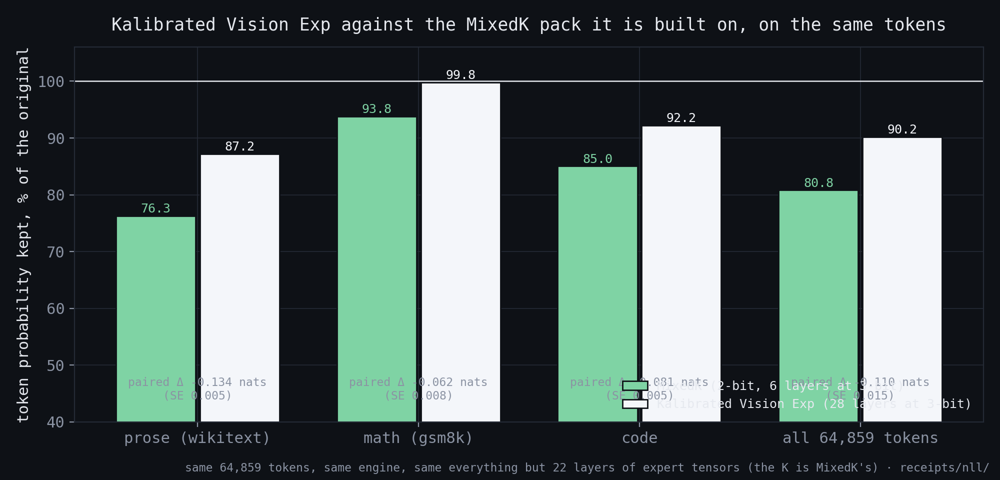
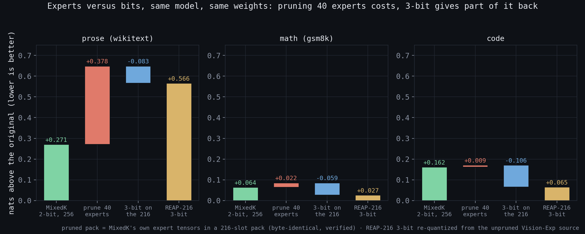
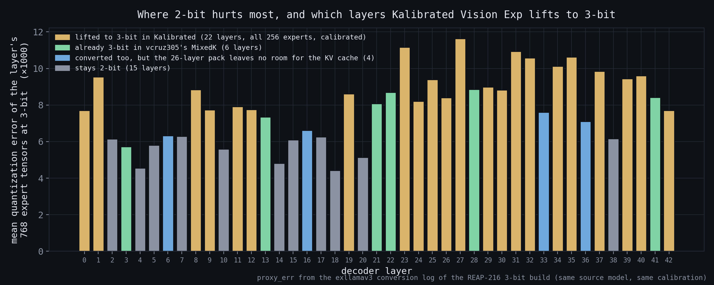

# Kalibrated Vision Exp — all 256 experts, 3-bit where it matters

**Kalibrated Vision Exp** (short: *Kalibrated*) is vcruz305's MixedK pack of DeepSeek-V4-Flash-Vision-Exp with 22 more
expert layers re-quantized at a *calibrated* 3-bit. The name says what it is: the K is MixedK's, the "calibrated" is the
part this repository adds. It was built as an extension of that pack, not as a replacement for it — 15 of its 43 expert
layers, every non-expert tensor, the vision tower and the draft plan are vcruz305's files, unchanged.

*Built and measured 2026-09-06/07 on one DGX Spark (GB10, 128 GB) plus five hours of a 2×H200 pod. Every number
below has a receipt in [`receipts/nll/`](../receipts/nll/) or [`receipts/kalibrated/`](../receipts/kalibrated/).*

## 1. What Kalibrated is, tensor by tensor

| | MixedK (vcruz305; the pack Kalibrated is built on) | REAP-216 3-bit (same model, this repo) | **Kalibrated Vision Exp** |
|---|---|---|---|
| routed experts per layer | 256 | 216 (40 pruned by the REAP plan) | **256** |
| expert bits | 2-bit on 37 layers, 3-bit on 6 | 3-bit on all 43 | **3-bit on 28 layers, 2-bit on 15** |
| weights resident | 83.6 GiB | 92.9 GiB | **100.1 GiB** |
| KV pool at util 0.88 / 0.92 / 0.925 | 986k tokens | 512k | **269k** |
| everything else | identical: attention, indexer, shared experts, router rows, hash tables, head, DSpark draft | | |

All three columns are the same base model: DeepSeek-V4-Flash-**Vision-Exp**, abliterated by drowzeys
(`base_model: deepseek-ai/DeepSeek-V4-Flash-Vision-Exp` on the source card). The string `0731` appears in this stack
only as the MiaAI-Lab entrypoint's default download target (skipped because the pack ships its own manifest) and as
the list of 64 expert *ids* the DSpark draft reuses from the 0731 draft plan; the draft's weights are built from the
Vision-Exp pack.

The 22 promoted layers are `27 23 31 35 32 34 37 40 1 39 25 29 8 30 19 26 24 11 12 9 0 42`, in ranking order; with
the MixedK pack's own six (`3 13 21 22 28 41`) that makes 28 of 43. The remaining 15 layers keep the MixedK 2-bit
tensors untouched. Promoting a layer costs 0.75 GiB (256 experts × 3 MiB); 26 promoted layers load fine but leave
0.63 GiB of KV against the 3.91 GiB one 245,760-token request needs, so the served pack stops at 22. Kalibrated is, structurally, a MixedK: same EXL3 trellis format, same `mcg`
codebook, same tp1 layout and non-expert tensors as vcruz305's pack, only with 28 layers at 3-bit instead of 6 —
and its 3-bit layers are calibrated (the MixedK pack's six carry a constant relative error per tensor, the
signature of exllamav3's uncalibrated fallback; swapping them for calibrated ones changed nothing measurable).

## 2. Results

Paired per-token NLL on the frozen 64,859-token corpus (wikitext 38,397 · gsm8k 9,031 · code 17,431), greedy, prefill
path, the same items for every pack. The reference is the full-precision FP8 checkpoint served on two Sparks.

| nats above the original (paired) → % of its token probability kept | prose | math | code | all |
|---|---|---|---|---|
| **Kalibrated** | **+0.137 → 87 %** | **+0.002 → 99.8 %** | **+0.081 → 92 %** | **+0.103 → 90 %** |
| MixedK (vcruz305) | +0.271 → 76 % | +0.064 → 94 % | +0.162 → 85 % | +0.213 → 81 % |
| REAP-216 3-bit (this repository's build) | +0.562 → 57 % | +0.025 → 98 % | +0.067 → 94 % | +0.354 → 70 % |
| 2-bit pruned to 216 (pack E, §3) | +0.649 → 52 % | +0.086 → 92 % | +0.171 → 84 % | +0.442 → 64 % |

"% kept" is exp(−Δ), the geometric mean over tokens of p_pack/p_original: the plain reading of a paired NLL
difference, 100 % = the original. **Cross-model, for orientation only:** the 0xSero/MiaAI-Lab 0731 REAP-216 3-bit
text pack, scored against the *Vision-Exp* original on the same tokens, sits at +0.647 / +0.090 / +0.063 / +0.412
(52 / 91 / 94 / 66 %). It is a different base model, so that row mixes the 0731↔Vision-Exp difference with its
quantization loss and says nothing about either alone; it is in the figures hatched for that reason.

| Kalibrated against MixedK, paired | prose | math | code |
|---|---|---|---|
| Δ nats (negative = Kalibrated better) | **−0.133** | **−0.062** | **−0.081** |
| SE over tokens | 0.005 | 0.008 | 0.005 |
| as perplexity | −12.5 % | −6.0 % | −7.8 % |

Other gates, Kalibrated vs MixedK: perplexity on 8 fixed passages 4.487 vs 4.545; MMLU-Pro (251 items, two option
orders, letter logprob) 63.2 % vs 64.3 % — the harness noise is ±1 item per run, so this is a tie; decode 37.6 / 34.1
/ 19.7 tok/s on code / counting / free prose with thinking vs 37.5 / 37.3 / 21.8 (medians of 3); verify steps 10.4–10.5
per second vs 11.4 — the promoted layers read 1.5× the bytes, and the step is bandwidth-bound.

Also checked on Kalibrated: two- and three-image prompts (correct per-image descriptions, no engine errors,
[`receipts/kalibrated/multi_image.log`](../receipts/kalibrated/multi_image.log)); the `)Skip` seeded slot still flips on the
decode path, p 0.15 vs 0.65 on MixedK ([`receipts/kalibrated/skip_slot_check.log`](../receipts/kalibrated/skip_slot_check.log)) —
weaker, not cured, the `bad_words` mask stays.

## 3. Experts versus bits, with the same weights

The obvious confound in "2-bit with 256 experts vs 3-bit with 216" is that two things change at once. Two packs
separate them, both built from the served 2-bit pack's own expert tensors so that nothing but the variable under test
moves:

- **pack E** — the 2-bit pack's own experts, only the 216 the REAP plan keeps, written into a 216-slot pack
  (byte-identical to the source tensors, verified on all 43 layers with `tools/verify_packE.py`). Router rows, hash
  tables, attention, head: the ones the REAP pack carries, i.e. the 2-bit pack's rows for the kept experts.
- **Vis3′** — the 216 kept experts re-quantized at 3-bit from the unpruned source (250 calibration rows), which turned
  out identical to the REAP-216 build above (+0.0025 nats).

| wikitext, nats above the source | | |
|---|---|---|
| 2-bit, 256 experts | +0.271 | |
| + prune 40 experts (pack E) | +0.649 | **pruning costs +0.378 (+46 % perplexity)** |
| + 3-bit on the 216 (Vis3′) | +0.566 | **3-bit gives back −0.083** |

On math and code the same decomposition reads +0.022 / +0.009 for the prune and −0.059 / −0.106 for the bits. So the
REAP plan — calibrated on agentic and tool-calling traffic — removes experts that prose needs (rare names, first
occurrences), and 3-bit helps everywhere once the experts are kept. That is the whole design of Kalibrated.

### A retraction

An earlier version of this study (2026-09-05) reported that pruning was *free*: a "cell C" run — the 2-bit pack with
the 40 pruned experts masked out at runtime — matched the unmasked pack to −0.0006 nats. That mask was applied in the
router's constructor and then overwritten when the checkpoint's `gate.bias`, `bias_vl` and `tid2eid` loaded, so the
run was the plain 2-bit pack. The tell, which should have been checked first: cell C and the plain run share 71.05 % of
their per-token logprobs, exactly the run-to-run noise between two plain runs (71.07 %); a real routing change (pack E,
the REAP build) leaves 8–10 % identical. Pack E is the real cell C. A routing mask must survive weight loading, and a
"no change" result on a masked run needs a per-token identity check before it is believed.

## 4. The engine at 216 experts is bit-exact

Before the retraction the obvious suspect was the engine: the same experts lose 0.38 nats in a 216-slot pack and
nothing in the 256-slot one. `tools/moe216_test.py` runs the serving container's fused EXL3 MoE (sparkinfer, the exact
prefill plan — block 64, capacity 4096 — and the decode plan — block 8) on real layer weights with the same routing,
once as the 256-slot pack and once as the 216-slot pack E: **0.00000 relative difference per row**, for the 3-bit
layer 3 and the 2-bit layer 5, with uniform, Zipf and tail-heavy routing. `tools/moe216_ref.py` dequantizes the same
experts with exllamav3 and recomputes the MoE in float: both packs sit at 0.09 % of it, the bf16 floor. The kernel is
fine; the weights were fine; the only thing wrong was the test. (One instrument note: `fused_moe.run()` returns a view
of its scratch arena — clone it before the next call, or every earlier result is overwritten.)

## 5. Which layers, and why

The conversion log of the 3-bit REAP build reports, for every expert tensor, the error of the quantized weight measured
on the calibration activations (`proxy_err`). Averaged over the 768 tensors of a layer it says how much a layer
amplifies quantization error — a proxy for where 2-bit hurts most. Kalibrated promotes the top of that ranking (excluding the
six layers the MixedK pack already holds at 3-bit); the six MixedK layers sit in the middle of the same ranking, which
is consistent with them having been chosen by some other rule. Under a linear share of the measured bits gain the 22
layers were expected to give about −0.05 nats on prose; they gave −0.133, so the ranking is picking sensitive layers
rather than random ones.

**Checked by measurement (2026-09-07).** Three trials, each the served 22-layer set with four layers swapped for the
four converted spares (`33 36 16 6`), one boot each, the same 64,859 tokens, paired against the served set:

| swapped out for the spares | Δ nats, all tokens | prose | math | code | z (token SE) |
|---|---|---|---|---|---|
| the four **lowest**-ranked promoted layers, `12 9 0 42` | **−0.001** | −0.001 | −0.003 | −0.001 | −0.7 (noise) |
| four **mid**-ranked layers, `25 29 8 30` | +0.011 | +0.014 | +0.004 | +0.008 | +4.5 |
| the **top** four, `27 23 31 35` | +0.017 | +0.025 | +0.011 | +0.002 | +6.9 |

The proxy ranking orders the layers the way the measurement does: the head of the ranking carries the gain, the tail
is interchangeable with the spares, and the served set is the best of the four measured. Shuffling the tail would gain
nothing, so the set stays as it is. Receipts: `receipts/nll/nll-swap-{tail,mid,head}-20260907.json` against
`receipts/nll/nll-aplus22-20260907.json`. Untested: 23–24 promoted layers at a shorter served context (each layer costs
0.75 GiB of KV pool).

## 6. How it was built (reproducible from `scripts/kalibrated/`; `aplus` in the file names is the build's working name)

1. **Convert on a pod** (`setup.sh`, `chain_aplus.sh`): exllamav3 0531096 with the conversion patches in
   `exl3-conversion.patch`, the abliterated source from the Hub (157 GB, gated), a full-model view, a per-tensor
   recipe with 3-bit on the 26 chosen layers and 2-bit elsewhere, `convert.py -cb mcg -cr 250 -cpi 600 -d 0,1`, the
   compile step skipped. Each finished 3-bit layer is spliced at once into a 256-expert file in the MixedK pack's exact
   K3 layout (`splice_qt.py` with an identity keep plan and the MixedK layer-3 header renamed per layer, byte size
   verified against the real file) so the Spark pulls during the run.
2. **Speed trick that is also a quality trick** (`switch.sh`, `chain_aplus_resume.sh`): the non-promoted layers only
   exist to propagate calibration activations, so after the first checkpoint their recipe entries were set to 16 bit
   (stored unquantized, exact activations, ~1.5 min per layer instead of 8) by editing the job's stored strategy in
   `work/args.json` and resuming with `convert.py -r` — note the converter re-reads `-cb` on resume and defaults to
   `mul1`, so `-cb mcg` must be passed again. 43 layers in 4 h 12 min on 2×H200.
3. **Assemble** (`pull_aplus.sh`, `make_aplus_pack.sh N`): pull with sha256 sidecars, then a pack directory made of
   hardlinks to the MixedK pack plus the N promoted files, with `config*.json` (`quantization_config.layer_bits`),
   `bitrates.json` and the rank-sliced manifest regenerated for that set. No copies: the pack costs 53 GB of disk, once.
4. **Boot ladder** (`boot_aplus.sh`): try N = 22, 21, 20 at `UTIL=0.925` (never above 0.93 on a 128 GB Spark), then the
   battery: paired NLL vs the 2-bit pack and vs the FP8 reference, the 8-passage perplexity, MMLU-Pro, dsbench.

## 6b. Two levers that were tried on 2026-09-07 and did not move

*Draft depth.* A public result on another model (an NVFP4 drafter trained for depth, draft length 4 → 16, +27 %)
suggested trying a deeper draft. Here the draft is DSpark: the model's own MTP module chained, trained with a block of
5. `DSPARK_TOKENS=8` with CUDA graphs captured at 9 tokens loses everywhere against the default 5 — decode 31.3 / 26.6 /
18.1 tok/s on counting / code / prose against 34.1 / 37.6 / 19.7, acceptance τ 3.21 / 2.84 / 1.94 against 3.26 / 3.65 /
1.88, verify steps 9.4–9.8 /s against 10.4–10.5 ([`receipts/kalibrated/dsbench-aplus22-k8-20260907.jsonl`](../receipts/kalibrated/dsbench-aplus22-k8-20260907.jsonl)).
The extra positions are almost never accepted and the wider verify batch costs ~10 % per step; depths under 5 are
refused by the DSpark validator. The draft stays at 5. Rebuilding the draft from this pack would change nothing: the
builder copies the `mtp.*` tensors, which Kalibrated leaves as they are in MixedK — only training a draft on this
target would move τ, and that is a different project.

*`)Skip` and the KV cache.* The remaining suspect for the decode-path token fault was the NVFP4 KV cache read by the
decode kernels. It cannot be A/B-tested on this stack: the packed MLA layout accepts only `fp8_ds_mla` or
`nvfp4_ds_mla`, and `fp8_ds_mla` fails at engine init with `swa_k_cache page stride 37376 is smaller than DSV4 page
width 37440` (the same error as plain `fp8`). The `bad_words` mask stays; `start.sh` applies it through the proxy.

## 7. Why not the other two routes

*Why more than MixedK's six 3-bit layers.* vcruz305 serves his pack on PyPI vLLM nightly with a plugin: non-expert
tensors in BF16, `enforce-eager`, a 65k verified context. On that stack six 3-bit layers is what the memory allows, and
the six were not calibrated (constant relative error per tensor, exllamav3's fallback). The stack used here — the
0xSero sparkinfer image with the non-expert tensors in FP8 and CUDA graphs — frees roughly 16 GiB, and this repository
spends them on 22 more expert layers at calibrated 3-bit rather than on a bigger KV pool (269k tokens instead of 986k;
one request of 245,760 tokens still fits). Nothing in that is a shortcoming of MixedK: it is the same pack with a
different memory budget.

*Why not the 0xSero/MiaAI-Lab route (prune to 216 experts, 3-bit everywhere).* Measured on this model with byte-identical
weights (§3), pruning the 40 REAP experts costs 76 → 52 % of the original's token probability on prose, and 3-bit on the
216 that remain gives back 52 → 57 %; keeping 256 experts and spending the bits on the sensitive layers gives 87 %. A
256-expert pack at 3-bit on all 43 layers would be ~111 GiB of expert tensors and does not leave room for a KV cache on
128 GB.

## 8. Credits

vcruz305 for the MixedK pack this is built on — the 2-bit experts, the non-expert tensors, the vision tower, the six
3-bit layers and the draft plan are his files — and for the parallel recipe that found the same `load_weights` bug the
same day; DeepSeek for DeepSeek-V4-Flash-Vision-Exp; drowzeys for the abliteration the source carries; 0xSero for the
sparkinfer image, the rank-sliced tp1 layout and the REAP-K216 keep list; MiaAI-Lab for the single-Spark recipe (and the
one-command install this repo mirrors); turboderp for EXL3 and a converter that takes a per-tensor recipe and resumes
from a checkpoint. If vcruz305 wants the 22 layer files folded into the MixedK pack itself, they are his to take: same
format, same layout, same license. Measured and written up on an ASUS Ascent GX10 by GaelicThunder.
